# 🚀 AWS Order Processing Infrastructure

<div align="center">

 
 


**Enterprise-Grade Order Processing System on AWS**

*Scalable • Secure • Observable • Serverless*

[🚀 Quick Start](#-quick-start) • [🏗️ Architecture](#️-architecture) • [📦 Deployment](#-deployment) • [🔧 API Usage](#-api-usage) • [📊 Monitoring](#-monitoring)

</div>

---

## 📋 Table of Contents

- [🎯 Overview](#-overview)
- [✨ Key Features](#-key-features)
- [🏗️ Architecture](#️-architecture)
- [🛠️ Tech Stack](#️-tech-stack)
- [🚀 Quick Start](#-quick-start)
- [📦 Deployment](#-deployment)
- [🔧 API Usage](#-api-usage)
- [📊 Monitoring](#-monitoring)
- [🔒 Security](#-security)
- [🧪 Testing](#-testing)
- [📁 Project Structure](#-project-structure)
- [🤝 Contributing](#-contributing)

---

## 🎯 Overview

This repository implements a **production-ready, enterprise-grade order processing infrastructure** on AWS using Infrastructure as Code (IaC) principles. Built with AWS CDK and TypeScript, it demonstrates advanced cloud architecture patterns including **parallel processing**, **comprehensive security**, and **observability**.

### 🎪 What Makes This Special?

- **🔄 Parallel Processing**: Simultaneous inventory checks and payment processing using AWS Step Functions
- **🛡️ Enterprise Security**: WAF protection with rate limiting, geo-blocking, and threat detection
- **📈 Full Observability**: CloudWatch dashboards, comprehensive logging, and metrics
- **⚡ Serverless Architecture**: 100% serverless with automatic scaling and cost optimization
- **🎯 Production Ready**: Proper error handling, retries, and monitoring

---

## ✨ Key Features

<table>
<tr>
<td>

### 🚀 **Performance**
- Parallel workflow execution
- Sub-second API response times
- Auto-scaling Lambda functions
- Optimized data flow

</td>
<td>

### 🛡️ **Security**
- AWS WAF protection
- Rate limiting (2000 req/5min)
- Geographic restrictions
- SQL injection prevention

</td>
</tr>
<tr>
<td>

### 📊 **Observability**
- Real-time CloudWatch dashboards
- Comprehensive logging
- Performance metrics
- Error tracking

</td>
<td>

### 🔧 **Reliability**
- Automatic retries
- Error handling
- State machine validation
- S3 data persistence

</td>
</tr>
</table>

---

## 🏗️ Architecture

```mermaid
graph TB
    Client[👤 Client] --> WAF[🛡️ AWS WAF]
    WAF --> API[🌐 API Gateway]
    
    API --> Lambda[⚡ API Lambda]
    Lambda --> |POST /orders| SF[🔄 Step Functions]
    Lambda --> |GET /orders| S3[📦 S3 Bucket]
    
    SF --> OrderProc[📋 Order Processor]
    OrderProc --> Parallel{🔀 Parallel Processing}
    
    Parallel --> Inventory[📦 Inventory Check]
    Parallel --> Payment[💳 Payment Process]
    
    Inventory --> Merge[🔗 Merge Results]
    Payment --> Merge
    
    Merge --> Store[💾 S3 Storage]
    
    subgraph "📊 Monitoring"
        CW[CloudWatch]
        Dashboard[📈 Dashboard]
        Logs[📝 Logs]
    end
    
    subgraph "🏠 Infrastructure"
        VPC[🏢 VPC]
        EC2[🖥️ EC2]
        SG[🔒 Security Groups]
    end
    
    style WAF fill:#ff6b6b
    style API fill:#4ecdc4
    style SF fill:#45b7d1
    style S3 fill:#96ceb4
    style CW fill:#ffeaa7
```



### 🔄 Workflow Process

1. **Request Ingestion**: API Gateway receives requests through WAF protection
2. **Order Processing**: Initial validation and data preparation
3. **Parallel Execution**: Simultaneous inventory and payment processing
4. **Result Aggregation**: Intelligent merging of parallel execution results
5. **Data Persistence**: Structured storage in S3 with versioning
6. **Response Delivery**: Comprehensive API responses with meaningful data

---

## 🛠️ Tech Stack

<details>
<summary><strong>🔽 Click to expand tech stack details</strong></summary>

| Category | Technology | Purpose |
|----------|------------|---------|
| **Infrastructure** | AWS CDK 2.140 | Infrastructure as Code |
| **Runtime** | Node.js 20.x | Lambda execution environment |
| **Language** | TypeScript 5.0 | Type-safe development |
| **Orchestration** | AWS Step Functions | Workflow management |
| **Compute** | AWS Lambda | Serverless functions |
| **Storage** | Amazon S3 | Object storage with versioning |
| **API** | Amazon API Gateway | RESTful API management |
| **Security** | AWS WAF v2 | Web application firewall |
| **Monitoring** | Amazon CloudWatch | Logging and metrics |
| **Networking** | Amazon VPC | Virtual private cloud |

</details>

---

## 🚀 Quick Start

### Prerequisites

- **AWS CLI** configured with appropriate permissions
- **AWS CDK CLI** installed (`npm install -g aws-cdk`)
- **Node.js 20.x** or later
- **npm** package manager

### 🎯 One-Command Setup

```bash
# Clone and setup
git clone <repository-url>
cd order-infra
npm install

# Deploy to AWS
npm run deploy:prod
```

### 🧪 Development Setup

```bash
# Install dependencies
npm install

# Run tests
npm test

# Build TypeScript
npm run build

# Deploy to development
npm run deploy:dev
```

---

## 📦 Deployment

### 🌍 Environment-Specific Deployment

```bash
# Production deployment with all features
npm run deploy:prod

# Development deployment
npm run deploy:dev

# Destroy infrastructure (be careful!)
npm run destroy
```

### 📊 Deployment Output

After successful deployment, you'll receive:

```
✅ OrderInfraStack

Outputs:
🌐 ApiGatewayUrl: https://xxxxxxxxxx.execute-api.region.amazonaws.com/prod/
🔄 StateMachineArn: arn:aws:states:region:account:stateMachine:practice-order-workflow
📦 S3BucketName: orderinfrastack-practices3bucketidxxxxx-xxxxx
📈 MonitoringDashboard: practice-order-monitoring-dashboard
🛡️ WAFWebACLArn: arn:aws:wafv2:region:account:webacl/practice-order-api-waf/xxxxx
```

---

## 🔧 API Usage

### 📝 Create Order (POST)

```bash
curl -X POST https://your-api-url/orders \
  -H "Content-Type: application/json" \
  -d '{
    "customerName": "John Doe",
    "items": [
      {"name": "Laptop", "quantity": 1, "price": 1200},
      {"name": "Mouse", "quantity": 2, "price": 25}
    ],
    "totalAmount": 1250
  }'
```

**Response:**
```json
{
  "message": "Order workflow started successfully",
  "executionArn": "arn:aws:states:...",
  "executionName": "execution-1234567890",
  "workflowStatus": "started",
  "inputData": { ... }
}
```

### 📖 Retrieve Orders (GET)

```bash
curl https://your-api-url/orders
```

**Response:**
```json
{
  "message": "Orders retrieved successfully",
  "orders": [
    {
      "orderId": "order-1234567890",
      "orderDetails": { ... },
      "inventoryCheck": { ... },
      "paymentProcessing": { ... },
      "finalStatus": "completed"
    }
  ],
  "totalCount": 15,
  "pagination": {
    "limit": 10,
    "hasMore": false
  }
}
```

---

## 📊 Monitoring

### 🎯 CloudWatch Dashboard

Access comprehensive monitoring through the **practice-order-monitoring-dashboard**:

- **📈 API Gateway Metrics**: Request count, latency, errors
- **🔄 Step Functions Metrics**: Executions, success/failure rates
- **🛡️ WAF Metrics**: Allowed/blocked requests, security events
- **⚡ Lambda Metrics**: Duration, memory usage, error rates

### 📝 Log Groups

| Service | Log Group | Purpose |
|---------|-----------|---------|
| Order Processor | `/aws/lambda/practice-order-processor-function` | Order validation logs |
| Inventory Check | `/aws/lambda/practice-inventory-check-function` | Stock verification logs |
| Payment Process | `/aws/lambda/practice-payment-process-function` | Payment processing logs |
| Merge Results | `/aws/lambda/practice-merge-results-function` | Result aggregation logs |
| S3 Storage | `/aws/lambda/practice-s3-storage-function` | Data persistence logs |
| API Lambda | `/aws/lambda/practice-api-lambda-function` | API request/response logs |
| Step Functions | `StepFunctions-practice-order-workflow` | Workflow execution logs |
| WAF | `aws-waf-logs-practice-order-api` | Security event logs |

---

## 🔒 Security

### 🛡️ AWS WAF Protection

- **Rate Limiting**: 2000 requests per 5-minute window per IP
- **Geographic Restrictions**: Blocks traffic from high-risk countries
- **Managed Rule Sets**: 
  - Core Rule Set (CRS)
  - Known Bad Inputs protection
  - IP Reputation filtering
- **Custom Rules**:
  - SQL Injection prevention
  - Cross-Site Scripting (XSS) protection

### 🔐 IAM Security

- **Least Privilege**: Each Lambda has minimal required permissions
- **Resource-Based Policies**: Fine-grained S3 and Step Functions access
- **Execution Roles**: Separate roles for each service component

---

## 🧪 Testing

### 🎯 Run Test Suite

```bash
# Run all tests
npm test

# Run tests with coverage
npm run test:coverage

# Run specific test file
npm test -- --testNamePattern="OrderInfraStack"
```

### 📊 Test Coverage

- **✅ Infrastructure Tests**: 50+ test cases covering all AWS resources
- **✅ Lambda Function Tests**: Unit tests for business logic
- **✅ Integration Tests**: End-to-end workflow validation
- **✅ Security Tests**: WAF rule validation

---

## 📁 Project Structure

```
order-infra/
├── 📁 lib/
│   └── 📄 order-infra-stack.ts     # Main CDK stack definition
├── 📁 bin/
│   └── 📄 order-infra.ts           # CDK app entry point
├── 📁 test/
│   └── 📄 order-infra.test.ts      # Infrastructure tests
├── 📄 package.json                 # Dependencies and scripts
├── 📄 tsconfig.json                # TypeScript configuration
├── 📄 cdk.json                     # CDK configuration
├── 📄 jest.config.js               # Jest test configuration
└── 📄 README.md                    # This file
```

---

## 🤝 Contributing

We welcome contributions! Please follow these steps:

1. **🍴 Fork** the repository
2. **🌿 Create** a feature branch: `git checkout -b feature/amazing-feature`
3. **💾 Commit** your changes: `git commit -m 'Add amazing feature'`
4. **📤 Push** to the branch: `git push origin feature/amazing-feature`
5. **🔄 Open** a Pull Request

### 📋 Development Guidelines

- Follow TypeScript best practices
- Add tests for new features
- Update documentation for changes
- Follow AWS Well-Architected principles

---

<div align="center">

## 🌟 Why This Project Stands Out

**🚀 Advanced Architecture** • **🛡️ Enterprise Security** • **📊 Full Observability** • **⚡ Production Ready**

*Built with passion for cloud excellence and modern DevOps practices*

---

<sub>Made with ❤️ using AWS CDK • TypeScript • Serverless Architecture</sub>

**[⬆ Back to Top](#-aws-order-processing-infrastructure)**

</div>
